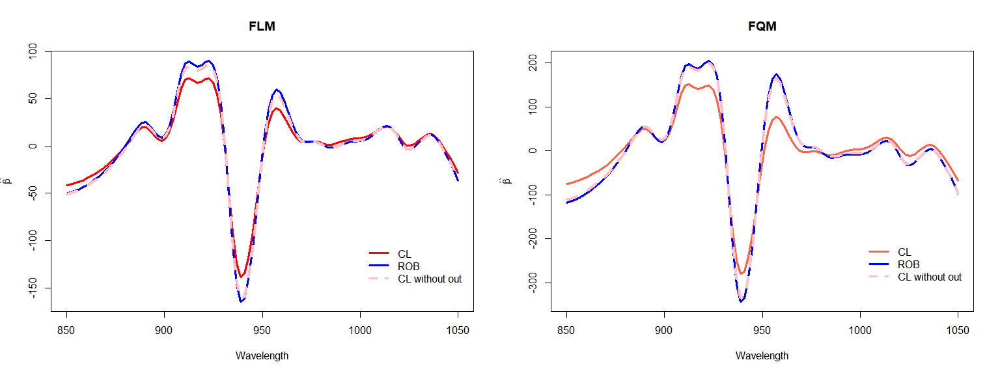

# Introduction

As it is well known, small proportions of outliers and other atypical
observations can affect seriously the estimators for regression models,
and the situation in functional linear or quadratic models is not an
exception. In fact, different types of outliers may arise when
considering functional data: in the functional setting, atypical data
might consist of curves that behave differently from the others
displaying a persistent behaviour either in shift, amplitude and/or
shape making more difficult their detection.

The following is a real data example of the implementation of robust
estimators for functional quadratic regression models. This robust
proposal involves robust estimators of the principal directions with
robust regression estimators based on a bounded loss function and a
preliminary residual scale estimator. This is part of a work in progress
done in collaboration with Prof. Dra. Graciela Boente \[Boente, G. and
Parada, D. (2022). *Robust estimation for functional quadratic
regression models*. Available at <https://arxiv.org/abs/2209.02742>.\]

More precisely, we first compute robust estimators of the principal
directions with the aim of providing finite-dimensional candidates for
the estimators of both the functional regression parameter and the
quadratic operator. We then apply MM–regression estimators (Yohai, 1987)
that are based on a bounded loss function and a preliminary residual
scale estimator to the residuals obtained from these finite-dimensional
spaces. The initial scale estimator ensures that the estimators of the
functional regression parameter and the quadratic operator are scale
equivariant, while the bounded loss function and the robust principal
directions guarantee that the resulting procedure will be robust against
high-leverage outliers. It is worth mentioning that the presence of
outliers in the functional covariates may affect the estimation
procedure when the sample principal components are used to estimate the
regression function and quadratic operator, even when MM-estimators are
used. The main reason is that a distorted estimator of the principal
direction will affect the scores of all the observations in that
direction, that is why robust estimators of the principal direction are
needed. We consider the spherical principal components introduced in
Locantore et al. (1999) and studied in Gervini (2008), Boente et
al. (2014) and Boente et al. (2019).

# Real data example: Tecator

We will use the Tecator data set available in the <code>fda.usc</code>
library from <code>R</code>
(<http://lib.stat.cmu.edu/datasets/tecator>). Each one of the 215
observations from this dataset consists of a spectrometric curve that
corresponds to the absorbance measured on an equally spaced grid of 100
wavelengths between 850 and 1050 nm with Tecator Infratec Food and Feed
Analyzer. The contents of fat protein and moisture were also recorded
through analytic chemistry methods. The goal of the analysis is to
predict the fat content (*y*) using some characteristics of the
spectrometric curve.

Let’s first load some <code>R</code> packages.

    library('fda')          # fda tools
    library('robustbase')   # lmrob 
    library(fda.usc)        # tecator dataset and fda tools
    library(gdata)          # uppertriangle
    library(lattice)        # plot

Let’s now load some custom <code>R</code> functions that are needed to
compute the robust estimators proposed.

    source('funciones-auxiliares.R') # aux functions
    source('descomponer3.R')         # for covariance decomposition
    source('minimizar.R')            # minimization menu

    datos <- data(tecator)
    absorp <- tecator$absorp.fdata
    absorp1 <- fdata.deriv(absorp,nderiv = 1)  #  computes the first derivative

Plots of the spectrometric data and it’s first derivative are displayed
below.

Functional boxplots of the spectrometric data and it’s first derivative
are displayed below. In both cases, only few observations are detected
as atypical even though is a well-known dataset which atypical data.

From now on, we will consider the first derivative of the spectrometric
curve, which we denote by *X*, as the functional explanatory variable
for the functional regression models to be considered.

-1.png)

# Robust Estimators under a Functional Linear/Quadratic Model

For the functional regression model, we consider two relationships
between the functional explanatory variable *X* and the scalar response
*y*.

Functional Linear Model (FLM):
*y* = *α* + ⟨*X*, *β*⟩ + *ϵ*

Functional Quadratic Model (FQM):
*y* = *α* + ⟨*X*, *β*⟩ + ⟨*X*, *Υ**X*⟩ + *ϵ*

In both cases, the purpose is to estimate the linear coefficient *β* and
the quadratic kernel *υ* related to the *Υ* operator in the quadratic
model (FQM). In that sense, we choose 4 principal directions which
explain more than 98% of the total variability as seen below, and
provide a robust fit that involves robust estimators of the principal
directions with robust regression estimators based on a bounded loss
function and a preliminary residual scale estimator.

    ## [1] 0.9841754

    ## [1] 0.9841754

Residuals boxplots both for linear (FLM) and quadratic (FQM) robust fit
are displayed below.

In both cases, we show the common outliers between residuals boxplots
and functional boxplots shown previously. As seen below, only
observations 35 and 140 are common outliers with the functional boxplots
for both linear (FLM) and quadratic (FQM) robust fit.

The residual plots show that the functional linear model (FLM) does not
seem to provide a reasonable fit for the robust method. Besides, when
looking at the residuals from the robust quadratic fit, some atypical
residuals are revealed. The boxplot of these residuals allows to
identify 32 observations as potential outliers, as seen below.

    ## [1] "The outliers from the robust FLM fit are:"

    ##  [1]   7  34  35  43  44  45 118 119 121 122 126 127 128 129 130 140 143 168 171
    ## [20] 172 185 186 215

    ## [1] "The common outliers with the functional boxplot are:"

    ## [1]  35 140

    ## [1] "The outliers from the robust FQM fit are:"

    ##  [1]   4   8  10  20  31  34  35  38  40  43  44  45 102 108 117 121 122 123 125
    ## [20] 126 127 129 131 140 171 172 174 175 183 186 211 215

    ## [1] "The common outliers with the functional boxplot are:"

    ## [1]  35 140

The curves corresponding to the 32 atypical observations identified on
the residuals boxplot from quadratic robust fit are displayed below in
red dashed lines.

The linear coefficient estimated from linear (FLM) robust fit, *β̂*, is
displayed as the red curve below.

The estimated parameters *β̂* and *υ̂* from the quadratic (FQM) robust fit
are displayed below as the blue curve and the coloured surface,
respectively.

We can now compare both *β* estimators from linear (FLM) and quadratic
(FQM) robust fit. As seen below, the shape is quite similar, but when
quadratic model is considered, the linear estimator take larger absolute
values for wavelengths varying between 880 and 980 nm.

The residual vs predicted plots, both for linear (FLM) and quadratic
(FQM) robust fit are displayed below. These residual plots also show
that the functional linear model does not seem to provide a reasonable
fit for the robust method. Also, when looking at the residuals from the
robust quadratic fit, some atypical residuals are revealed.

# Classic Estimators under a Functional Linear/Quadratic Model and comparison between their robust counterparts

We now want to compare the robust estimators with the ones obtained when
using a classical procedure for both linear (FLM) and quadratic (FQM)
model. We refer to “classical procedure” as the estimation procedure
based on sample principal directions and least squares approach.

As before, we choose 4 principal directions for the classic fit which
explain more than 97% of the total variability, as seen below.

    ## [1] 0.9791543

The linear coefficient estimated from linear (FLM) classic fit, *β̂*, is
displayed as the red curve below.

We can now compare *β* estimates in the linear model (FLM) for both
classic (CL) and robust (ROB) fit. As seen beofre, the shape is quite
similar, but when robust fit is considered, the linear estimator take
larger absolute values for wavelengths varying between 910 and 960 nm.

The estimated parameters *β̂* and *υ̂* from the quadratic (FQM) classic
fit are displayed below as the red curve and the coloured surface,
respectively.

We can now compare *β* estimates in the quadratic model (FQM) between
classic (CL) and robust (ROB) fit. As seen below, the shape is quite
similar, but when robust fit is considered, the linear estimator take
larger absolute values for wavelengths varying between 900 and 980 nm.

Residual vs predicted plots, both for linear (FLM) and quadratic (FQM)
model in the classic fit are displayed below. These residual plots show,
again, that the functional linear model (FLM) does not seem to provide a
reasonable fit for the classical method either.

# Analysis without outliers

We now repeat the classical analysis, both for linear (FLM) and
quadratic (FQM) model, computed without the detected potential outliers
that have been identified in the residual boxplot from the robust
quadratic fit(these 32 observationes were manually removed). We will
refer it as “CL without out”. Again, we choose 4 principal directions
which explain more than 97% of the variability as seen below.

    ## [1] 0.9774696

Predicted vs residuals plots in the linear (FLM) and quadratic (FQM)
classic without outliers (CL without out) fit are shown in the first
pair of plots.

In the second pair of plots, we show estimated *β* parameters for
classic (CL), robust (ROB) and classic after outliers removal (CL
without out) fit, both for linear (FLM) and quadratic (FQM) model. As
seen below, when estimating the linear regression function *β*, the
classical estimators computed without the detected potential outliers
are very close to the robust ones, that is, the robust estimator behaves
similarly to the classical one if one were able to manually remove
suspected outliers.

Note that for both the linear coefficient *β* and the quadratic kernel
*υ*, the shape of the classical estimators computed without the
suspected atypical observations, resembles that of the robust ones. To
visualize more clearly the similarity between the surfaces related to
the quadratic kernel estimators, we present the surfaces differences
between classic (CL) and robust (ROB) fit, and between classic without
outliers (CL without out) and robust (ROB) fit, both for quadratic
model. As seen below, when estimating the quadratic operator, the
classical estimators computed without the detected potential outliers
are very close to the robust ones, that is, the robust estimator behaves
similarly to the classical one if one were able to manually remove
suspected outliers.

