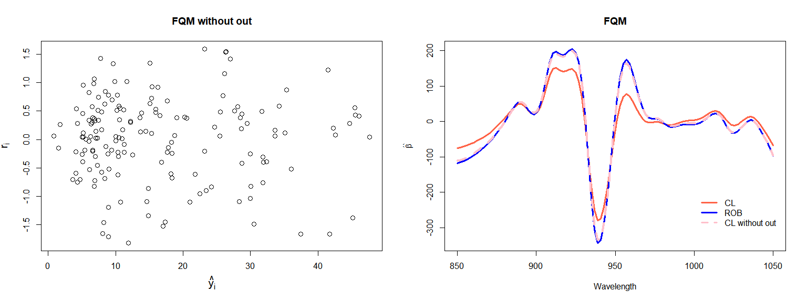

# Introduction

This page contains the <code>R</code> code to compute the robust
estimates for functional quadratic models defined in *Robust estimation
for functional quadratic regression models* (available at
<https://arxiv.org/abs/2209.02742>). The following is a real data
example of the implementation of robust estimators for functional
quadratic regression models. This robust proposal involves robust
estimators of the principal directions with robust regression estimators
based on a bounded loss function and a preliminary residual scale
estimator.

More precisely, we first compute robust estimators of the principal
directions with the aim of providing finite-dimensional candidates for
the estimators of both the functional regression parameter and the
quadratic operator and we then apply MM–regression estimators.

# Real data example: Tecator

We will use the Tecator data set available in the <code>fda.usc</code>
library from <code>R</code>
(<http://lib.stat.cmu.edu/datasets/tecator>). Each observation from this
dataset consists of a spectrometric curve that corresponds to the
absorbance measured on an equally spaced grid of 100 wavelengths between
850 and 1050 nm. The spectrometric curves of these 215 samples of finely
chopped meat were measured with Tecator Infratec Food and Feed Analyzer.
The contents of fat protein and moisture were also recorded through
analytic chemistry methods. The goal of the analysis is to predict the
fat content (*y*) using some characteristics of the spectrometric curve.

To predict the fat content of a meat sample from its absorbance
spectrum, Yao and Müller (2010) fitted a functional quadratic model,
while Horvath and Reeder (2013) tested the significance of the quadratic
term. However, Boente and Vahnovan (2017) and Febrero-Bande and de la
Fuente (2012), among others, showed the presence of atypical data in the
spectrometric curves.

Let’s first load some <code>R</code> packages.

    library('fda')          # fda tools
    library('robustbase')   # lmrob 
    library(fda.usc)        # tecator dataset and fda tools
    library(gdata)          # uppertriangle
    library(lattice)        # plot

Let’s now load some custom <code>R</code> functions that are needed to
compute the robust estimators proposed.

    source('funciones-auxiliares.R') # aux functions
    source('descomponer3.R')         # for covariance decomposition
    source('minimizar.R')            # minimization menu

    datos <- data(tecator)
    absorp <- tecator$absorp.fdata
    absorp1 <- fdata.deriv(absorp,nderiv = 1)  #  computes the first derivative

Plots of the spectrometric data and it’s first derivative are displayed
below.

Functional boxplots of the spectrometric data and it’s first derivative
are displayed below. In both cases, only few observations are detected
as atypical even though is a well-known dataset which atypical data.

From now on, we will consider the first derivative of the spectrometric
curve, which we denote by *X*, as the functional explanatory variable
for the functional regression models to be considered.

-1.png)

# Robust Estimators under a Functional Linear/Quadratic Model

For the functional regression model, we consider two relationships
between the functional explanatory variable *X* and the scalar response
*y*.

Functional Linear Model (FLM):
*y* = *α* + ⟨*X*, *β*⟩ + *ϵ*

Functional Quadratic Model (FQM):
*y* = *α* + ⟨*X*, *β*⟩ + ⟨*X*, 𝛶*X*⟩ + *ϵ*

In this real data example, our purpose is to estimate the linear
coefficient *β* and the quadratic kernel *υ* related to the 𝛶 operator
in the quadratic model (FQM). In that sense, we choose 4 principal
directions which explain more than 98% of the total variability as seen
below, and provide a robust fit that involves robust estimators of the
principal directions with robust regression estimators based on a
bounded loss function and a preliminary residual scale estimator.

    # y = vector of scalar responses = fat ;
    # x = matrix of functional covariates ;
    # ttt= the grid over which the functional covariates were evaluated;

    # freq = the number of principal directions used;
    # or
    # varexp := the percentage of explained variability;

    # cov_type = type of estimates for the estimate for the principal directions;
    #           'cl' for classical or
    #           'gerS' for robust (Gervini, 2008) with S-ordering 

    # fLoss = the loss function to be minimized ('ls' or 'lmrob'); 

    set.seed(124)
    covariable <- 'd1' # first derivative

    indices <- 1:215

    # Sample index
    tecdatos <- submuestra(indices, covariable = covariable)

    indices_tecdatos <- indices
    dt_tecdatos <- tecdatos$t[2] - tecdatos$t[1]

    ##################################################
    ## Choose the number of principal directions.
    ## Since it is equal to 4, then varexp should be 1
    ##################################################

    freq = 4
    varexp = 1

    ###############################################
    ## ROBUST ESTIMATE UNDER A FLM
    ## fat = alfa_0 + < absorp1, beta_0 > + epsilon
    ###############################################

    est_rob_LINEAL <- estimar(
      y = tecdatos$y,
      x = tecdatos$x,
      ttt = tecdatos$t,
      ajuste = 'lineal',
      freq = freq,
      cov_type = 'gerS',
      fLoss = 'lmrob',
      cterho = 3.443689,
      nresamp = 5000,
      varexp = varexp
    )

    ######################################
    # Percentage explained by 4 directions
    ######################################

    est_rob_LINEAL$porcentaje

    ## [1] 0.9841754

    #0.9841754

    #################################
    # Store the estimates and compute 
    # predictions for the residuals
    #################################

    beta_rob_LINEAL <- est_rob_LINEAL$beta

    phies_rob_LINEAL <- est_rob_LINEAL$autofun

    coef_rob_LINEAL <-   tecdatos$x %*% phies_rob_LINEAL * dt_tecdatos

    predichos_ROB_LINEAL <-
      est_rob_LINEAL$alfa + coef_rob_LINEAL %*% est_rob_LINEAL$slope_coef

    ##############################################################################
    ## ROBUST ESTIMATOR UNDER A FQM
    ## fat = alfa_0 + < absorp1, beta_0 > + <absorp1, Upsilon_0 absorp1> + epsilon
    ##############################################################################

    est_rob_CUADRA <-
      estimar(
        y = tecdatos$y,
        x = tecdatos$x,
        ttt = tecdatos$t,
        ajuste = 'quadra',
        freq = freq,
        cov_type = 'gerS',
        fLoss = 'lmrob',
        cterho = 3.443689,
        nresamp = 5000,
        varexp = varexp
      )

    #######################################
    # percentage explained by 4 directions
    #######################################

    est_rob_CUADRA$porcentaje

    ## [1] 0.9841754

    #0.9841754

    #################################
    # Store the estimates and compute 
    # predictions for the residuals
    #################################

    beta_rob_CUADRA <- est_rob_CUADRA$beta
    gamma_rob_CUADRA <- est_rob_CUADRA$gamma
    phies_rob <- est_rob_CUADRA$autofun

    coef_rob_CUADRA <-   tecdatos$x %*% phies_rob * dt_tecdatos

    predichos_ROB_CUADRA <-
      est_rob_CUADRA$alfa + coef_rob_CUADRA %*% est_rob_CUADRA$slope_coef + 
      diag(coef_rob_CUADRA %*% est_rob_CUADRA$gama_coef %*% t(coef_rob_CUADRA))

    ################################
    ## Residuals from the robust fit
    ################################

    residuos_ROB_CUADRA_tecdatos <- tecdatos$y - predichos_ROB_CUADRA

    residuos_ROB_LINEAL_tecdatos <- tecdatos$y - predichos_ROB_LINEAL

Residuals boxplots both for linear (FLM) and quadratic (FQM) robust fit
are displayed below.

In both cases, we show the common outliers between residuals boxplots
and functional boxplots shown previously. As seen below, only
observations 35 and 140 are common outliers with the functional boxplots
for both linear (FLM) and quadratic (FQM) robust fit.

The residual plots show that the functional linear model (FLM) does not
seem to provide a reasonable fit for the robust method. Besides, when
looking at the residuals from the robust quadratic fit, some atypical
residuals are revealed. The boxplot of these residuals allows to
identify 32 observations as potential outliers, as seen below.

    ## [1] "The outliers from the robust FLM fit are:"

    ##  [1]   7  34  35  43  44  45 118 119 121 122 126 127 128 129 130 140 143 168 171
    ## [20] 172 185 186 215

    ## [1] "The common outliers with the functional boxplot are:"

    ## [1]  35 140

    ## [1] "The outliers from the robust FQM fit are:"

    ##  [1]   4   8  10  20  31  34  35  38  40  43  44  45 102 108 117 121 122 123 125
    ## [20] 126 127 129 131 140 171 172 174 175 183 186 211 215

    ## [1] "The common outliers with the functional boxplot are:"

    ## [1]  35 140

The curves corresponding to the 32 atypical observations identified on
the residuals boxplot from quadratic robust fit are displayed below in
red dashed lines.

The linear coefficient estimated from a linear (FLM) robust fit is
displayed as the red curve below.

The estimates of the parameters *β* and *υ* obtained from the quadratic
(FQM) robust fit are displayed below as the blue curve and the coloured
surface, respectively.

We can now compare *β* estimators obtained from a linear (FLM) and
quadratic (FQM) robust fit. As seen below, the shape is quite similar,
but when quadratic model is considered, the estimator takes larger
absolute values for wavelengths varying between 880 and 980 nm.

The residual vs predicted plots, both for linear (FLM) and quadratic
(FQM) robust fit are displayed below. These residual plots also show
that the functional linear model does not seem to provide a reasonable
fit for the robust method. Also, when looking at the residuals from the
robust quadratic fit, some atypical residuals are revealed.

# Classical Estimators under a Functional Linear/Quadratic Model and comparison between their robust counterparts

We now want to compare the robust estimators with the ones obtained when
using a classical procedure for both linear (FLM) and quadratic (FQM)
model. We refer to “classical procedure” as the estimation procedure
based on sample principal directions and least squares approach.

As before, we choose 4 principal directions for the classical fit which
explain more than 97% of the total variability, as seen below.

    ####################################
    ## LEAST SQUARE ESTIMATE UNDER A FLM
    ####################################

    est_CL_LINEAL <-
      estimar(
        y = tecdatos$y,
        x = tecdatos$x,
        ttt = tecdatos$t,
        ajuste = 'lineal',
        freq = freq,
        cov_type = 'cl',
        fLoss = 'ls',
        cterho = 3.443689,
        nresamp = 5000,
        varexp = varexp
      )

    ######################################
    # Percentage explained by 4 directions
    ######################################

    est_CL_LINEAL$porcentaje

    ## [1] 0.9791543

    #0.9791543

    #################################
    # Store the estimates and compute
    # predictions for the residuals
    #################################

    beta_CL_LINEAL <- est_CL_LINEAL$beta
    phies_CL_LINEAL <- est_CL_LINEAL$autofun

    coef_CL_LINEAL <-   tecdatos$x %*% phies_CL_LINEAL * dt_tecdatos

    predichos_CL_LINEAL <-
      est_CL_LINEAL$alfa + coef_CL_LINEAL %*% est_CL_LINEAL$slope_coef

    ####################################
    ## LEAST SQUARE ESTIMATE UNDER A FQM
    ####################################

    est_CL_CUADRA <-
      estimar(
        y = tecdatos$y,
        x = tecdatos$x,
        ttt = tecdatos$t,
        ajuste = 'quadra',
        freq = freq,
        cov_type = 'cl',
        fLoss = 'ls',
        cterho = 3.443689,
        nresamp = 5000,
        varexp = varexp
      )

    #################################
    # Store the estimates and compute
    # predictions for the residuals
    #################################

    beta_CL_CUADRA <- est_CL_CUADRA$beta
    gamma_CL_CUADRA <- est_CL_CUADRA$gamma
    phies_CL <- est_CL_CUADRA$autofun

    coef_CL_CUADRA <-   tecdatos$x %*% phies_CL * dt_tecdatos

    predichos_CL_CUADRA <-
      est_CL_CUADRA$alfa + coef_CL_CUADRA %*% est_CL_CUADRA$slope_coef + 
      diag(coef_CL_CUADRA %*% est_CL_CUADRA$gama_coef %*% t(coef_CL_CUADRA))

    #######################################
    #  RESIDUALS FROM THE LEAST SQUARES FIT
    #######################################

    residuos_CL_CUADRA_tecdatos <- tecdatos$y - predichos_CL_CUADRA

    residuos_CL_LINEAL_tecdatos <- tecdatos$y - predichos_CL_LINEAL

The linear coefficient estimated from linear (FLM) classical fit is
displayed as the red curve below.

We can now compare *β* estimates in the linear model (FLM) using the
classical (CL) and robust (ROB) fit. As seen before, the shape is quite
similar, but the estimates of *β* under the robust fit take larger
absolute values for wavelengths varying between 910 and 960 nm.

The estimates of *β* and *υ* from the quadratic (FQM) classical fit are
displayed below as the red curve and the coloured surface, respectively.

We can now compare the estimates of the slope *β* obtained by the least
squares (CL) and robust preocedures (ROB) under the quadratic model
(FQM). As seen below, the shape is quite similar, but when robust fit is
considered, the robust estimator takes larger absolute values for
wavelengths varying between 900 and 980 nm.

Residual vs predicted plots, both for linear (FLM) and quadratic (FQM)
model using the classical fit are displayed below. These residual plots
show, again, that the functional linear model (FLM) does not seem to
provide a reasonable fit for the classical method either.

# Analysis without outliers

We now compute the classical least squares estimates with the data set
without the detected potential outliers using a quadratic model assuming
a linear (FLM) and quadratic (FQM) model. We will refer it as “CL
without out”. Again, we choose 4 principal directions which explain more
than 97% of the variability as seen below.

    ############################
    ## Data without outliers
    ############################

    tecdatos_sin_out <-
      submuestra(indices_tecdatos[-atipicos_CUADRA_tecdatos], covariable = covariable)

    #######################################
    ## CLASSICAL ESTIMATOR WITHOUT OULTIERS
    ## FQM
    #######################################

    est_CL_CUADRA_sin_out <-
      estimar(
        y = tecdatos_sin_out$y,
        x = tecdatos_sin_out$x,
        ttt = tecdatos_sin_out$t,
        ajuste = 'quadra',
        freq = freq,
        cov_type = 'cl',
        fLoss = 'ls',
        cterho = 3.443689,
        nresamp = 5000,
        varexp = varexp
      )

    ###############################################
    # Store parameters and compute predicted values
    ###############################################

    beta_CL_CUADRA_sin_out <- est_CL_CUADRA_sin_out$beta
    gamma_CL_CUADRA_sin_out <- est_CL_CUADRA_sin_out$gamma
    phies_CL_sin_out <- est_CL_CUADRA_sin_out$autofun

    coef_CL_CUADRA_sin_out <-
      tecdatos_sin_out$x %*% phies_CL_sin_out * dt_tecdatos

    predichos_CL_CUADRA_sin_out <-
      est_CL_CUADRA_sin_out$alfa + coef_CL_CUADRA_sin_out %*% est_CL_CUADRA_sin_out$slope_coef +
      diag(
        coef_CL_CUADRA_sin_out %*% est_CL_CUADRA_sin_out$gama_coef %*% t(coef_CL_CUADRA_sin_out)
      )

    ####################################################
    ## RESIDUALS FROM THE CLASSICAL FIT WITHOUT OUTLIERS
    ####################################################

    residuos_CL_CUADRA_tecdatos_sin_out <-
      tecdatos_sin_out$y - predichos_CL_CUADRA_sin_out

Predicted vs residuals plots in the linear (FLM) and quadratic (FQM)
classical without outliers (CL without out) fit are shown in the first
pair of plots.

In the second pair of plots, we show estimated *β* parameters for
classical (CL), robust (ROB) and classical after outliers removal (CL
without out) fit, both for linear (FLM) and quadratic (FQM) model. As
seen below, when estimating the linear regression function *β*, the
classical estimators computed without the detected potential outliers
are very close to the robust ones, that is, the robust estimator behaves
similarly to the classical one if one were able to manually remove
suspected outliers.

Note that for both the linear coefficient *β* and the quadratic kernel
*υ*, the shape of the classical estimators computed without the
suspected atypical observations, resembles that of the robust ones. To
visualize more clearly the similarity between the surfaces related to
the quadratic kernel estimators, we present the surfaces differences
between classical (CL) and robust (ROB) fit, and between classical
without outliers (CL without out) and robust (ROB) fit, both for
quadratic model. As seen below, when estimating the quadratic operator,
the classical estimators computed without the detected potential
outliers are very close to the robust ones, that is, the robust
estimator behaves similarly to the classical one if one were able to
manually remove suspected outliers.

